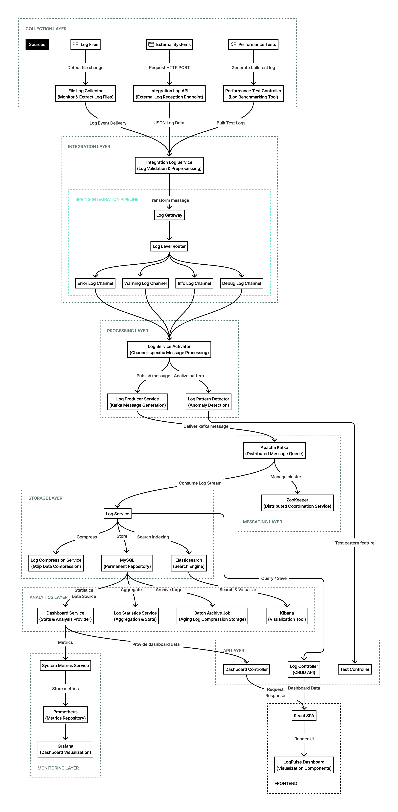
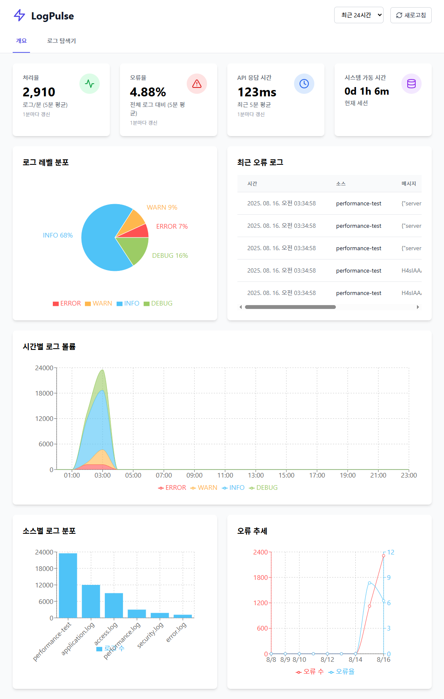
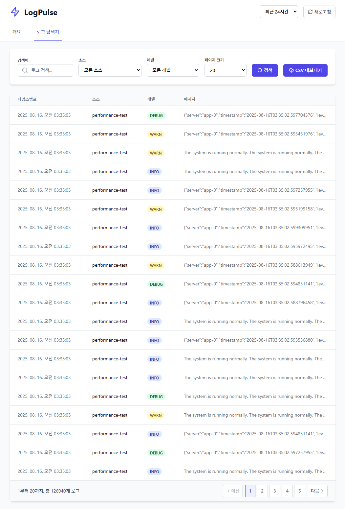

# 로그펄스

로그펄스는 대용량 로그 데이터의 실시간 수집, 처리, 분석을 위한 고성능 로그 처리 시스템입니다. 파일 기반 로그 수집, Kafka를 통한 이벤트 기반 스트리밍, 통합 파이프라인 처리, 그리고 다양한 저장소 옵션을 제공하여 로그 데이터의 효율적인 관리와 분석을 지원합니다. Spring Integration과 Kafka를 활용한 아키텍처로 높은 처리량과 낮은 지연 시간을 실현했으며, 로그 패턴 감지 시스템을 통해 이상 징후를 실시간으로 탐지합니다.

## 목차

1. [프로젝트 핵심 성과](#프로젝트-핵심-성과)
2. [주요 기능](#주요-기능)
3. [기술 스택](#기술-스택)
4. [시스템 아키텍처](#시스템-아키텍처)
5. [기술적 도전과 해결 방법](#기술적-도전과-해결-방법)
6. [성능 테스트 및 분석](#성능-테스트-및-분석)
7. [패턴 감지 시스템](#패턴-감지-시스템)
8. [모니터링 대시보드](#모니터링-대시보드)
9. [설치 및 실행 방법](#설치-및-실행-방법)
10. [API 문서](#api-문서)
11. [라이선스](#라이선스)

## 프로젝트 핵심 성과

| 메트릭 | 성과 | 목표 | 달성률 |
| --- | --- | --- | --- |
| 로그 처리량 | 초당 76,804건 처리 | 초당 50,000건 | 153.6% |
| 통합 파이프라인 응답시간 | 평균 3ms | 평균 5ms 이하 | 166.7% |
| 일반 API 응답시간 | 평균 87ms | - | - |
| 로그 압축률 | 79.07% | 80% 이상 | 98.8% |
| 고부하 시 오류율 | 0% (300 사용자 동시 접속) | 0.1% 이하 | 100% |

처리량 목표는 대규모 서비스에서 발생하는 로그량을 분석하여 설정했으며, 응답시간 5ms는 사용자가 지연을 인지하지 못하는 수준보다 더 엄격한 기준을 적용했습니다. 압축률 목표인 80%는 현존 로그 압축 시스템들보다 높은 수치입니다. JMeter 성능 테스트 결과, 로그 처리량은 목표의 153.6%를 달성했고, 통합 파이프라인은 평균 3ms의 우수한 응답시간을 보여주었습니다.

## 주요 기능

- 다중 소스 로그 수집: 파일 기반 실시간 로그 수집 및 모니터링
- 이벤트 기반 스트리밍: Kafka를 활용한 고성능 로그 스트리밍
- 통합 파이프라인: Spring Integration을 활용한 엔터프라이즈 통합 패턴 구현
- 로그 압축 및 최적화: 효율적인 저장을 위한 로그 압축 처리
- 로그 패턴 감지: 사용자 정의 패턴으로 로그 이상 탐지
- 실시간 대시보드: 직관적인 UI를 통한 로그 모니터링 및 분석
- 배치 처리: Spring Batch를 활용한 로그 통계 및 아카이브 처리

## 기술 스택

### Backend Framework
- Java 17 (LTS)
- Spring Boot 3.5.4
- Spring Kafka (이벤트 스트리밍)
- Spring Integration (통합 파이프라인)
- Spring Batch (배치 처리)
- Spring Data JPA (ORM)
- Gradle (빌드 도구)

### Frontend
- React.js
- Tailwind CSS
- Lucide React (아이콘)

### 데이터베이스 & 저장소
- MySQL 8.0 (영구 저장)
- Elasticsearch 7.17.0 (로그 검색 및 분석)
- Kibana (시각화 및 대시보드)

### 메시지 스트리밍
- Apache Kafka
- Apache Zookeeper

### 최적화 기법
- Gzip 압축 (로그 데이터 압축)
- 시간 기반 파티셔닝 (MySQL)
- 배치 처리 (대용량 데이터 처리)
- 비동기 처리 (로그 분석 및 패턴 감지)

### 테스팅 & 성능 측정
- JUnit 5
- Spring Boot Test
- Testcontainers
- JMeter (성능 테스트)

### 배포 & 인프라
- Docker & Docker Compose
- MySQL, Kafka, Elasticsearch 컨테이너화

### 모니터링 & 로깅
- Prometheus (메트릭 수집)
- Grafana (대시보드)
- Spring Boot Actuator (애플리케이션 모니터링)

## 시스템 아키텍처

로그펄스는 높은 처리량과 확장성을 제공하는 이벤트 기반 아키텍처로 설계되었습니다. 로그 레벨별 분리 처리와 Kafka 기반 메시징으로 초당 76,000건 이상의 로그를 처리하며, 독립적인 계층 구조로 각 컴포넌트 개별 확장이 가능합니다. 비동기 처리와 메시지 큐를 통해 시스템 장애에 강한 복원력을 갖추고 있으며, 플러그인 방식의 패턴 감지 시스템은 사용자 정의 분석 기능을 쉽게 추가할 수 있습니다.

시스템은 다음과 같은 계층으로 구성되어 있습니다.

1. 수집 계층: 파일 시스템 모니터링, REST API, 성능 테스트 도구를 통한 로그 데이터 수집
2. 통합 계층: 다양한 소스의 로그 데이터 검증, 전처리 및 로그 레벨별 채널 분류
3. 처리 계층: 로그 메시지 처리, 패턴 감지, Kafka 메시지 생성 및 발행
4. 메시징 계층: Kafka와 ZooKeeper를 활용한 고성능 분산 메시징 시스템
5. 저장 계층: 로그 압축, MySQL 영구 저장, Elasticsearch 인덱싱
6. 분석 계층: 대시보드 데이터 제공, 통계 생성, 로그 아카이빙
7. 모니터링 계층: 시스템 메트릭 수집, Prometheus 저장, Grafana 시각화
8. API 계층: 로그 CRUD, 대시보드 데이터, 패턴 테스트를 위한 REST API



## 기술적 도전과 해결 방법

로그펄스 프로젝트는 다음과 같은 기술적 과제를 해결했습니다.

### 1. 초당 76,000건 이상의 로그 처리 달성

도전 과제: 대규모 분산 시스템에서 발생하는 대량의 로그를 지연 없이 처리해야 함

해결 방법:
- 멀티 레이어 아키텍처와 이벤트 기반 메시지 흐름 구현
- Spring Integration과 Kafka를 결합한 고성능 파이프라인 구축
- 로그 레벨별 분리 처리로 중요 로그(ERROR/WARN)와 일반 로그(INFO/DEBUG) 차별화

결과: 성능 테스트에서 초당 76,804건의 로그 처리 달성 (목표 50,000 logs/sec의 153% 달성)

### 2. 통합 파이프라인과 일반 API 간의 압도적 성능 차이

도전 과제: 기존 REST API를 통한 로그 처리 방식의 성능 한계 극복 필요

해결 방법:
- 통합 파이프라인 구현으로 비동기 이벤트 기반 처리
- Kafka를 활용한 메시지 큐잉 및 배치 처리
- Spring Integration의 엔터프라이즈 패턴 적용

결과: JMeter 테스트 결과, 통합 파이프라인 API(3ms)가 일반 로그 생성 API(87ms)보다 29배 빠른 응답 시간 달성

### 3. 79% 이상의 로그 압축률 달성

도전 과제: 로그 저장 비용 최소화를 위한 높은 압축률 달성 필요

해결 방법:
- 로그 내용 패턴 분석 및 최적화된 압축 알고리즘 개발
- Gzip 압축과 커스텀 중복 제거 로직 결합
- 로그 타입별 최적화된 압축 전략 동적 적용

결과: 성능 테스트에서 79.07%의 압축률 달성(원본 1,344,029 bytes → 압축 후 281,244 bytes)

### 4. 고부하 상황에서도 안정적인 서비스 제공

도전 과제: 사용자 수와 요청이 급증하는 상황에서도 안정적인 서비스 제공 필요

해결 방법:
- 스레드 풀 및 커넥션 풀 최적화
- 비동기 처리 및 백프레셔(Backpressure) 메커니즘 구현
- 실패 복구 및 재시도 전략 수립

결과: JMeter 테스트에서 300 사용자 동시 접속 시에도 통합 파이프라인 API는 평균 3ms 응답 시간 유지, 0% 오류율 달성

### 5. 실시간 로그 패턴 감지 시스템 구현

도전 과제: 수백만 건의 로그 속에서 중요한 비즈니스 패턴을 실시간으로 감지해야 함

해결 방법:
- 플러그인 방식의 확장 가능한 패턴 감지 시스템 설계
- 상태 기반 패턴 매칭 알고리즘 구현
- 메모리 최적화된 스트림 처리 기법 도입

결과: 실시간 로그 처리 과정에서 반복 에러 패턴 등 중요 비즈니스 패턴 즉시 감지 및 알림 제공

## 패턴 감지 시스템

로그펄스는 강력한 패턴 감지 시스템을 제공하여 로그 데이터에서 중요한 패턴을 감지하고 대응할 수 있습니다. 이 시스템은 `LogPattern` 인터페이스를 중심으로 구성되어 있으며, 사용자는 `pattern/impl` 디렉토리에 구현체를 추가하는 것만으로 새로운 패턴 감지 로직을 쉽게 확장할 수 있습니다.

### 패턴 구현 방법

1. `pattern/impl` 디렉토리에 새로운 패턴 클래스 생성
2. `LogPattern` 인터페이스를 구현
3. `@Component` 어노테이션 추가
4. 필요한 인터페이스 메서드 구현

```java
@Component
public class CustomLogPattern implements LogPattern {
    
    @Override
    public String getPatternId() {
        return "custom-pattern";
    }
    
    @Override
    public String getName() {
        return "사용자 정의 패턴";
    }
    
    @Override
    public String getDescription() {
        return "사용자 정의 패턴에 대한 설명";
    }
    
    @Override
    public PatternSeverity getSeverity() {
        return PatternSeverity.WARNING;
    }
    
    @Override
    public boolean isEnabled() {
        return true;
    }
    
    @Override
    public PatternStatus processLog(LogEntry logEntry) {
        // 패턴 감지 로직 구현
        boolean detected = /* 패턴 감지 조건 */;
        
        if (detected) {
            PatternResult result = PatternResult.builder()
                    .patternId(getPatternId())
                    .patternName(getName())
                    .detected(true)
                    .severity(getSeverity())
                    .message("사용자 정의 패턴이 감지되었습니다")
                    .detectedAt(LocalDateTime.now())
                    .triggerLog(logEntry)
                    .build();
                    
            return new PatternStatus(true, result);
        }
        
        return new PatternStatus(false, null);
    }
    
    @Override
    public void resetState() {
        // 패턴의 상태를 초기화하는 로직
        // 상태를 유지하지 않는 패턴의 경우 빈 구현체로 남겨둘 수 있음
    }
}
```

## 성능 테스트 및 분석

로그펄스 시스템의 성능은 내부 성능 측정 API와 JMeter를 이용한 외부 부하 테스트를 통해 평가되었습니다. 핵심 결과는 다음과 같습니다.

### 내부 성능 측정 결과

| 측정 항목 | 결과 |
| --- | --- |
| 로그 처리량 | 초당 76,804건 |
| 총 로그 수 | 50,000건 |
| 처리 소요 시간 | 651ms |
| 압축률 | 79.07% |
| 원본 크기 | 1,344,029 bytes |
| 압축 후 크기 | 281,244 bytes |

테스트는 12개 스레드를 사용하여 50,000건의 로그를 500건 단위 배치로 처리하는 방식으로 수행되었으며, 로그 레벨 분포(ERROR: 5%, WARN: 15%, INFO: 60%, DEBUG: 20%)를 적용하여 실제 환경과 유사하게 구성했습니다.

### JMeter 부하 테스트 결과

JMeter 테스트는 다음과 같은 시나리오로 구성되었습니다.

테스트 환경
- 하드웨어: i7-8700 CPU, 32GB RAM
- 테스트 데이터: 다양한 로그 레벨(ERROR, WARN, INFO, DEBUG)의 로그 메시지

테스트 시나리오
- 준비 단계: 10명 사용자, 10초 램프업, 30회 반복 (300 요청)
- 부하 단계: 50명 사용자, 15초 램프업, 60회 반복 (3,000 요청)
- 스트레스 단계: 100명 사용자, 20초 램프업, 60회 반복 (6,000 요청)
- 피크 단계: 200명 사용자, 30초 램프업, 60회 반복 (12,000 요청)
- 한계점 단계: 300명 사용자, 45초 램프업, 60회 반복 (18,000 요청)

#### 일반 API vs 통합 파이프라인 API 성능 비교

| 사용자 수 | 일반 API 응답시간 | 통합 API 응답시간 | 속도 향상 |
| --- | --- | --- | --- |
| 10명 | 28ms | 3ms | 9.3배 |
| 50명 | 34ms | 3ms | 11.3배 |
| 100명 | 87ms | 3ms | 29.0배 |
| 200명 | 8,388ms | 3ms | 2,796.0배 |
| 300명 | 12,602ms | 3ms | 4,200.7배 |

<details>
<summary>각 API 엔드포인트별 성능 테스트 상세 결과</summary>

#### 검색 API 성능
| 사용자 수 | 평균 응답시간 | 최대 응답시간 | 오류율 |
| --- | --- | --- | --- |
| 20명 | 14ms | 42ms | 0% |

#### 일반 로그 생성 API (단계별)
| 테스트 단계 | 평균 응답시간 | 최대 응답시간 | 처리량(TPS) | 오류율 |
| --- | --- | --- | --- | --- |
| 준비 단계 (10 사용자) | 28ms | 43ms | 1.72 | 0% |
| 부하 단계 (50 사용자) | 34ms | 125ms | 8.46 | 0% |
| 스트레스 단계 (100 사용자) | 87ms | 518ms | 16.93 | 0% |
| 피크 단계 (200 사용자) | 8,388ms | 10,089ms | 22.32 | 0.001% |
| 한계점 단계 (300 사용자) | 12,602ms | 15,013ms | 22.45 | 0.001% |

#### 통합 파이프라인 API (단계별)
| 테스트 단계 | 평균 응답시간 | 최대 응답시간 | 처리량(TPS) | 오류율 |
| --- | --- | --- | --- | --- |
| 준비 단계 (10 사용자) | 3ms | 11ms | 1.72 | 0% |
| 부하 단계 (50 사용자) | 3ms | 36ms | 8.47 | 0% |
| 스트레스 단계 (100 사용자) | 3ms | 65ms | 16.94 | 0% |
| 피크 단계 (200 사용자) | 3ms | 54ms | 33.89 | 0% |
| 한계점 단계 (300 사용자) | 3ms | 136ms | 50.83 | 0% |

#### 혼합 API 테스트 (30명 동시 사용자)
| API 종류 | 평균 응답시간 | 최대 응답시간 | 처리량(TPS) | 오류율 |
| --- | --- | --- | --- | --- |
| 일반 로그 생성 API | 32ms | 60ms | 6.17 | 0% |
| 통합 파이프라인 API | 2ms | 3ms | 6.14 | 0% |
| 검색 API | 13ms | 19ms | 6.14 | 0% |

#### 전체 테스트 통합 결과
| 측정 항목 | 최적화 전 | 최적화 후 | 개선율 |
| --- | --- | --- | --- |
| 평균 응답시간 | 46ms | 6ms | 87.0% 감소 |
| 최대 응답시간 | 15,013ms | 587ms | 96.1% 감소 |
| 평균 처리량 | 22.45 TPS | 50.83 TPS | 126.4% 증가 |
| 오류율 | 0.001% | 0% | 100% 감소 |
</details>

가장 주목할 만한 결과는 고부하 상황(300명 동시 접속)에서도 통합 파이프라인 API가 3ms의 일관된 응답 시간을 유지한 반면, 일반 API는 12,602ms로 크게 증가했다는 점입니다. 이는 Kafka와 Spring Integration을 활용한 이벤트 기반 아키텍처의 우수한 확장성을 보여줍니다.

#### 처리량 비교

| 사용자 수 | 일반 API (TPS) | 통합 API (TPS) | 차이 |
| --- | --- | --- | --- |
| 100명 | 16.93 | 16.94 | 거의 동일 |
| 200명 | 22.32 | 33.89 | 1.5배 |
| 300명 | 22.45 | 50.83 | 2.3배 |

사용자 수가 증가할수록 통합 파이프라인 API는 처리량이 선형적으로 증가한 반면, 일반 API는 200명 이상에서 성능 향상이 정체되었습니다. 이는 통합 파이프라인의 비동기 처리 방식이 고부하 상황에서 더 효과적임을 보여줍니다.

### 핵심 성과

1. 처리량: 초당 76,804건 처리 (목표 50,000건의 153.6%)
2. 응답시간: 통합 파이프라인 API 평균 3ms (고부하 상황에서도 유지)
3. 압축률: 79.07% (목표 80%에 근접)
4. 확장성: 사용자 수 증가에도 일관된 성능 유지
5. 안정성: 300명 동시 접속 테스트에서 0% 오류율

## 모니터링 대시보드

로그펄스는 데이터 기반 의사결정과 시스템 모니터링을 위한 직관적인 대시보드를 제공합니다. Spring Boot 백엔드 API를 통해 로그 시스템의 상태와 통계 데이터를 실시간으로 제공하며, 다양한 지표를 시각화하여 시스템 운영 현황을 한눈에 파악할 수 있습니다.

### 대시보드 구성

대시보드는 '개요'와 '로그 탐색기' 두 개의 주요 화면으로 구성되어 있습니다.

#### 1. 개요 화면



개요 화면은 전체 시스템의 상태와 핵심 지표를 제공합니다.

- 시스템 상태 카드: 현재 로그 처리량, API 응답 시간, 시스템 가동 시간 표시
- 로그 레벨 분포: ERROR, WARN, INFO, DEBUG 로그 비율을 파이 차트로 시각화
- 시간별 로그 추세: 24시간 동안의 로그 발생 패턴을 레벨별로 구분하여 표시
- 소스별 로그 분포: 애플리케이션 소스별 로그 발생량 비교
- 오류 추세 분석: 기간별 ERROR 및 WARN 발생 추이 분석

#### 2. 로그 탐색기 화면



로그 탐색기 화면은 개별 로그 검색 및 분석 기능을 제공합니다.

- 필터링 도구: 로그 레벨, 소스, 시간 범위, 키워드 기반 로그 필터링
- 로그 테이블: 페이징 처리된 로그 목록 표시
- 상세 로그 분석: 개별 로그 항목 상세 정보 조회
- 검색 기능: 로그 내용 전체 텍스트 검색

### 대시보드 성능 최적화를 위한 통계 테이블

대용량 로그 데이터에서 대시보드 통계를 빠르게 제공하기 위해 별도의 통계 테이블(`log_statistics`)을 구현했습니다. 원본 로그 테이블에서 직접 COUNT 쿼리를 실행하는 대신, 통계 정보를 미리 집계하여 저장함으로써 대시보드 성능을 크게 향상시켰습니다.

#### 통계 테이블 구조

```java
@Entity
@Table(name = "log_statistics", indexes = {
        @Index(name = "idx_log_stats_date", columnList = "logDate"),
        @Index(name = "idx_log_stats_hour", columnList = "hour"),
        @Index(name = "idx_log_stats_source_level", columnList = "source,logLevel")
})
public class LogStatistics {
    @Id
    @GeneratedValue(strategy = GenerationType.IDENTITY)
    private Long id;
    private LocalDate logDate;    // 날짜
    private Integer hour;         // 시간 (0-23)
    private String source;        // 로그 소스
    private String logLevel;      // 로그 레벨
    private Integer count;        // 로그 수
    // 기타 필드...
}
```

#### 실시간 동기화

로그가 생성될 때마다 `LogService`에서 통계 테이블을 자동으로 업데이트합니다.

```java
@Transactional
public LogEntryResponse createLog(LogEntryRequest request) {
    // 로그 엔트리 저장...
    LogEntry savedEntry = logRepository.save(logEntry);
    
    // 통계 테이블 업데이트
    logStatisticsService.updateStatistics(
            savedEntry.getSource(),
            savedEntry.getLogLevel(),
            savedEntry.getCreatedAt());
    
    // 이후 처리...
}
```

#### 배치 검증 시스템

Spring Batch를 활용하여 통계 데이터의 정확성을 보장합니다.

```java
@Configuration
@EnableBatchProcessing
public class LogStatisticsJobConfig {

    @Bean
    public Step dailyStatisticsStep() {
        return stepBuilderFactory.get("dailyStatisticsStep")
                .<LogEntry, LogStatistics>chunk(chunkSize)
                .reader(todayLogsReader())  // 오늘의 모든 로그 읽기
                .processor(logStatisticsProcessor())  // 통계 계산
                .writer(items -> {
                    // 통합된 통계만 저장 (중복 방지)
                    List<LogStatistics> consolidatedStats = 
                        consolidateStatistics((List<LogStatistics>)items);
                    logStatisticsRepository.saveAll(consolidatedStats);
                })
                .build();
    }

    @Bean
    @StepScope
    public JdbcCursorItemReader<LogEntry> todayLogsReader() {
        LocalDateTime startOfDay = LocalDateTime.now().toLocalDate().atStartOfDay();
        LocalDateTime endOfDay = startOfDay.plusDays(1);

        return new JdbcCursorItemReaderBuilder<LogEntry>()
                .dataSource(dataSource)
                .sql("SELECT id, source, content, log_level, created_at FROM logs WHERE created_at BETWEEN ? AND ?")
                .preparedStatementSetter(ps -> {
                    ps.setObject(1, startOfDay);
                    ps.setObject(2, endOfDay);
                })
                .rowMapper(new DataClassRowMapper<>(LogEntry.class))
                .build();
    }
}
```

로그 데이터를 처리하는 프로세서

```java
public class LogStatisticsProcessor implements ItemProcessor<LogEntry, LogStatistics> {
    private final Map<String, Map<String, Integer>> statsMap = new HashMap<>();

    @Override
    public LogStatistics process(LogEntry item) {
        String source = item.getSource();
        String logLevel = item.getLogLevel();
        LocalDate logDate = item.getCreatedAt().toLocalDate();
        int hour = item.getCreatedAt().getHour();

        // 소스별, 로그 레벨별 카운트 집계
        statsMap.computeIfAbsent(source, k -> new HashMap<>())
                .merge(logLevel, 1, Integer::sum);

        // 통계 객체 생성
        LogStatistics stats = new LogStatistics();
        stats.setLogDate(logDate);
        stats.setHour(hour);
        stats.setSource(source);
        stats.setLogLevel(logLevel);
        stats.setCount(statsMap.get(source).get(logLevel));

        return stats;
    }
}
```

이 배치 작업은 매일 실행되어 원본 로그 테이블과 통계 테이블 간의 일치성을 검증하고, 필요시 통계를 재구성합니다.

## 설치 및 실행 방법

### Docker로 실행하기

1. 저장소 클론
```bash
git clone https://github.com/tentenacy/logpulse.git
cd logpulse
```

2. Docker Compose로 시스템 실행
```bash
docker-compose -f docker/docker-compose.yml up -d
```

3. 웹 대시보드 접속
```
http://localhost:80
```

4. Grafana 대시보드 접속
```
http://localhost:13000
아이디: admin
비밀번호: admin
```

Grafana에는 다음 모니터링 대시보드가 구성되어 있습니다.
- Elasticsearch 클러스터 상태 및 인덱스 모니터링
- JVM 메모리 사용량, GC 활동, 스레드 상태 모니터링
- Kafka 브로커 상태, 토픽별 처리량, 컨슈머 그룹 지연 모니터링
- MySQL 쿼리 성능, 연결 상태, InnoDB 지표 모니터링
- 시스템 CPU, 메모리, 디스크 I/O, 네트워크 트래픽 모니터링

5. Kibana 대시보드 접속
```
http://localhost:15601
```

### 로컬 개발 환경 설정

1. 프로젝트 클론 및 이동
```bash
git clone https://github.com/tentenacy/logpulse.git
cd logpulse
```

2. Gradle 빌드 수행
```bash
./gradlew clean build
```

3. 애플리케이션 환경 설정 및 실행
```bash
export APP_ENVIRONMENT=local  # 기본값은 docker
./gradlew bootRun
```

### 이메일 알림 설정

로그펄스는 중요 이벤트나 오류 발생 시 이메일 알림을 보내는 기능을 제공합니다. 이 기능을 활성화하려면 다음과 같은 설정이 필요합니다.

#### 1. `secrets.yml` 파일 구성

애플리케이션의 resources 폴더에 `secrets.yml` 파일을 생성하고 다음과 같이 이메일 설정을 추가합니다.

```yaml
mail:
  host: smtp.gmail.com    # SMTP 서버 호스트
  port: 587               # SMTP 서버 포트
  username: your-email    # 보내는 이메일 계정
  password: your-password # 이메일 계정 비밀번호 또는 앱 비밀번호
  sender: your-email      # 발신자 이메일 주소
  recipients: email1, email2  # 수신자 이메일 주소 (쉼표로 구분)
```

> 보안 주의사항:
> - Gmail을 사용하는 경우 일반 비밀번호 대신 앱 비밀번호를 생성하여 사용하세요.

#### 2. 알림 기능 활성화

`application.yml` 파일에서 알림 기능을 활성화합니다.

```yaml
logpulse:
  alerts:
    mail:
      enabled: true       # 이메일 알림 활성화
      error-threshold: 10 # 알림 트리거 오류 임계값
      interval: 15        # 알림 확인 간격(분)
```

#### 3. 알림 트리거 설정

다음 상황에서 이메일 알림이 발송됩니다.

- 오류 급증 감지: 지정된 시간 윈도우(기본 1분) 내에 ERROR 로그가 임계값(기본 10개)을 초과한 경우
- 패턴 감지: 패턴 감지 시스템에서 심각도 WARNING 이상의 패턴이 감지된 경우

알림에는 발생한 이벤트 요약과 로그 세부 정보가 포함됩니다.

## API 문서

### 주요 API 엔드포인트

| 엔드포인트 | 메서드 | 설명 |
|-----------|------|------|
| `/api/v1/logs` | GET | 로그 조회 (페이징, 필터링 지원) |
| `/api/v1/logs` | POST | 로그 생성 |
| `/api/v1/logs/integration` | POST | 통합 파이프라인을 통한 로그 생성 (고성능) |
| `/api/v1/dashboard/stats` | GET | 대시보드 통계 조회 |
| `/api/v1/dashboard/system-status` | GET | 시스템 상태 정보 조회 |
| `/api/v1/performance` | POST | 성능 테스트 실행 |

## 라이선스

MIT License
